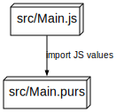
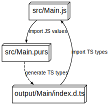

+++
title = "PureScript's foreign Functions less foreign"
slug = "purescript-ffi"
insert_anchor_links = "heading"
date = "2023-11-11"
description = "Learn the basics PureScript's FFI and improve safety with type checked `JSDoc` and `ts-bridge`."
+++

*Learn the basics PureScript's FFI and improve safety with type checked `JSDoc` and `ts-bridge`.*

## Code Samples

The final code that is explained in this blog post can be found in [this repo](https://github.com/thought2/ffi-less-foreign).

## Implicit contracts: Introduction to PureScript's foreign function interface (FFI)

### The perils of importing values from JavaScript

Let's look at the most basic example of importing a foreign value from JavaScript into a PureScript module. On the PureScript side we use the `foreign import` syntax to declare a type for a value that will be provided by JavaScript. On the JavaScript side we export the actual implementation for this value:




_Main.purs:_

```hs
module Main where

foreign import val1 :: Number
```

_Main.js:_

```js
export const val1 = 13.0;
```

This is by definition a potentially unsafe piece of code. The only thing that the PureScript compiler checks here is that a JavaScript file named `Main.js` exists and that it exports a value named `val1`. There's no way to check if the given type matches on both sides. Nothing prevents us to define `val1` as a string on the JavaScript side. E.g like:

```js
export const val1 = "three";
```

Chances are high that this will cause a runtime error at some other point in the program. How can we do better? The following post will demonstrate how this unsafety can be mitigated gradually.

### Examples of more complex imports

#### Combined types

But before we start, let's first look at some slightly more complicated examples of foreign imports. By the way, this is called most of the time "FFI", which stands for foreign function interface. But as you could see in the first example it's not only functions that can be imported from PureScript but also any kind of values.

We can also import/export combined types like Records and Arrays:

_Main.purs:_

```hs
module Main where

foreign import val2 :: { name :: String, hobbies :: Array String }
```

_Main.js:_

```js
export const val2 = {
  name: "Alice",
  hobbies: ["running", "swimming"],
};
```

#### Functions, curried or uncurried

We can import curried functions:

_Main.purs:_

```hs
module Main where

foreign import val3 :: String -> Boolean -> Number
```

_Main.js:_

```js
export const val3 = (str) => (isTrue) => {
  // Some random pure code:
  return isTrue ? str.length : 0;
};
```

We can use some helpers to export uncurried functions to make the JS code more idiomatic:

_Main.purs:_

```hs
module Main where

import Data.Function.Uncurried (Fn2)

foreign import val4 :: Fn2 String Boolean Number
```

_Main.js:_

```js
export const val4 = (str, isTrue) => {
  // Some random pure code:
  return isTrue ? str.length : 0;
};
```

#### Functions with effects

And we can also declare some functions to be effectful. And, as you can image, all of the above can be combined and mixed:

_Main.purs:_

```hs
module Main where

import Effect.Uncurried (EffectFn2, EffectFn3)

foreign import val5
  :: EffectFn3
       { onTick :: EffectFn2 String Number Boolean }
       Boolean
       String
       { cancel :: Effect Unit }
```

_Main.js:_

```js
export const val5 = (opts, bool, str) => {
  // Some random side effecting code:
  
  const intervalId = setInterval(() => {
    const result = opts.onTick("abc", 13);
    console.log(result ? "Tick!" : "Tack!");
  }, 1000.0);

  return {
    cancel: () => {
      clearInterval(intervalId);
      console.log("canceled!");
    },
  };
};
```

Values of type `Fn2`, `Fn3`, or `EffectFn4` can be easily converted into idiomatic PureScript functions using helpers like `runFn2`, `runFn3`, or `runEffectFn4`. And they can be created from PureScript functions with `mkFn2`, `mkFn3`, or `mkEffectFn4`.

Now we have defined 5 sample values that we want to import from JavaScript to PureScript. Some are simple, others more complex. But what they share is that all of them have an _implicit_ contract that the dynamic JavaScript code matches the type signature on the PureScript side.
It's _implicit_ because in order to check this we need to read the whole JavaScript code to make sure the function parameters are used in the "right way" at every place. Especially the last example (`val5`) should demonstrate how easy it is to make some mistakes in the body of the function.

### Which types can be used in FFI?

Generally all values can be used in FFI of which the runtime representation is known and guaranteed to be equal for every compiler backend. This is the case for primitives like `String`, `Boolean`, `Number`, `Array`, `Record`, `Function` as well as some other types that claim to give you this guarantee. E.g. `Fn1..n`, `EffectFn1..n` or types like `Nullable`.

It's important to keep in mind that PureScript data types, like `Maybe`, `Either`, `Tuple` or some others that you define yourself, don't have this guarantee. So they cannot be used in FFI. Concretely their representation differs in the standard JavaScript compiler backend and the [optimized one](https://github.com/aristanetworks/purescript-backend-optimizer).

## Improvement 1: Make contracts explicit with TypeScript and JSDoc

Now I'd like to demonstrate a very simple way to make the above examples safer by making the _implicit_ contracts _explicit_ by using [JSDoc](https://jsdoc.app/). The PureScript code stays at it is but on the JavaScript side we add some JSDoc annotations to the exported values:

*src/Main.js:*
```js
// @ts-check

/**
 * @type {number}
 */
export const val1 = 13.0;

/**
 * @type {{name : string, hobbies: Array<string>}}
 */
export const val2 = {
  name: "Alice",
  hobbies: ["running", "swimming"],
};

/** @type {(str: string) => (isTrue: boolean) => number}  */
export const val3 = (str) => (isTrue) => {
  // Some random pure code:
  return isTrue ? str.length : 0;
};

/** @type {(str: string, isTrue: boolean) => number}  */
export const val4 = (str, isTrue) => {
  // Some random pure code:
  return isTrue ? str.length : 0;
};

/** @type {(opts: {onTick : (str : string, num: number) => boolean}, bool: number, str: string) => {cancel : () => void}}  */
export const val5 = (opts, bool, str) => {
  // Some random side effecting code:
  
  const intervalId = setInterval(() => {
    const result = opts.onTick("abc", 13);
    console.log(result ? "Tick!" : "Tack!");
  }, 1000.0);

  return {
    cancel: () => {
      clearInterval(intervalId);
      console.log("canceled!");
    },
  };
};
```

This is still a JavaScript file, but as you can see in the first line we added a `@ts-check` directive. This enables the TypeScript compiler to check the JSDoc annotations. More information about this can be [found here](https://www.typescriptlang.org/docs/handbook/jsdoc-supported-types.html). So if you run `tsc` (the CLI of the TypeScript Compiler) inside the repository you will get errors if the implementations of the values don't match up with the provided type annotations. Here's an example:

```sh
npm install typescript

tsc --allowJs --noEmit src/Main.js
```

If you change the line `opts.onTick("Hello", 13)` to e.g. `opts.onTick("Hello", "13")`, you'll get a type error from TypeScript.

You can also configure a `tsconfig.json` file to make this work for the whole folder.

At this point the manual reviewing of the code became much easier and less error prone. We only need to check if the provided PureScript type signatures match up with the JSDoc annotations. We don't have to read every single line of the JavaScript code anymore to be confident that the types are correct.

## Improvement 2: Statically check the contracts with `ts-bridge`

For some users this might be enough. But if you want to go one step further and statically check the contract between PureScript and JavaScript you can use the `ts-bridge` tool. This library can generate TypeScript types from PureScript types. Let's see how it can be set up for our examples. 
Will will extend the build architecture as shown in the following diagram:



First we need to install the `ts-bridge` library:

```sh
spago install ts-bridge
```

Now we need to change the PureScript file slightly. The FFI definitions remain the same but we'll add some imports and the following section to the bottom:

```hs
import DTS as DTS
import TsBridge as TSB
import TsBridge.Class (Tok(..))

-- FFI definitions from above ...

tsModules :: Either TSB.AppError (Array DTS.TsModuleFile)
tsModules =
  TSB.tsModuleFile "Main"
    [ TSB.tsTypeAliasesFromValues TSB.Tok
        { val1
        , val2
        , val3
        , val4
        , val5
        }
    ]
```

Moreover we add a separate module to the codebase which will be used to generate the TypeScript types:

```hs
module Bridge where

import Prelude

import DTS as DTS
import Data.Either (Either)
import Effect (Effect)
import Main as Main
import TsBridge as TSB
import TsBridge as TsBridge

myTsProgram :: Either TSB.AppError DTS.TsProgram
myTsProgram =
  TSB.tsProgram
    [ Main.tsModules
    ]

main :: Effect Unit
main = TsBridge.mkTypeGenCli myTsProgram
```

That's it. Now we can run `spago run --main Bridge` and we'll get the following output:

```sh
output/Main/index.d.ts
```

This means that TypeScript types were generated for the `Main` module and written to the `output/Main/index.d.ts` file. Let's have a look at the content of this file:

```ts
export type val1 = number;

export type val2 = { readonly hobbies: Array<string>; readonly name: string };

export type val3 = (_: string) => (_: boolean) => number;

export type val4 = (arg1: string, arg2: boolean) => number;

export type val5 = (
  arg1: { readonly onTick: (arg1: string, arg2: number) => boolean },
  arg2: boolean,
  arg3: string
) => { readonly cancel: () => void };   
```

Those are exactly the signatures that we manually added in the JS file in the form of JSDoc annotations. But now they are generated automatically from the PureScript code.

As a last step we need a way to replace the handwritten type definitions with the generated ones. Luckily TypeScript has extended the JSDoc syntax to support many of TypeScript specific features, especially we can use the import statement to replace the concrete types:

*src/Main.js:*
```js
// @ts-check

/**
 * @type {import("../output/Main").val1}
 */
export const val1 = 13.0;

/**
 * @type {import("../output/Main").val2}
 */
export const val2 = {
  name: "Alice",
  hobbies: ["running", "swimming"],
};

/**
 * @type {import("../output/Main").val3}
 */
export const val3 = (str) => (isTrue) => {
  // Some random pure code:
  return isTrue ? str.length : 0;
};

/**
 * @type {import("../output/Main").val4}
 */
export const val4 = (str, isTrue) => {
  // Some random pure code:
  return isTrue ? str.length : 0;
};

/**
 * @type {import("../output/Main").val5}
 */
export const val5 = (opts, bool, str) => {
  // Some random side effecting code:
  
  const intervalId = setInterval(() => {
    const result = opts.onTick("abc", 13);
    console.log(result ? "Tick!" : "Tack!");
  }, 1000.0);

  return {
    cancel: () => {
      clearInterval(intervalId);
      console.log("canceled!");
    },
  };
};
```

You can check that this works by running the full build pipeline which is now:

```
spago run --main Bridge
tsc --allowJs --noEmit src/Main.js
spago build
```

## Conclusion

PureScript's foreign function interface is a very powerful feature. However, it comes with the cost of being quite unsafe: This is because it needs to close the gap between the PureScript type system and the dynamically typed JavaScript.
However, nowadays JavaScript is not that unsafe anymore. Many libraries are written in TypeScript or at least additional type declarations are being provided.
That's a value that we can use to make the FFI safer. To be fair, it cannot be as safe as code that has been written natively in PureScript. There are still many pitfalls to be aware of once the interfaces get more complex. But still it's a big improvement over the "implicit" contracts that we had before.

PureScript is still a language with a relatively small community and therefore a the ecosystem is not as large as the one of JavaScript. By bridging the gap between PureScript and TypeScript we can leverage the power of the TypeScript ecosystem and make it available to PureScript users. This may also encourage newcomers to use PureScript. For instance I was amazed to see that the interoperability with TypeScript was one of the first features promoted by the language ReScript: On their [website](https://rescript-lang.org/) they write: "Use any library from JavaScript, export ReScript libraries to JavaScript, automatically generate TypeScript types".

I wrote [ts-bridge](https://github.com/thought2/purescript-ts-bridge) about a year ago with the goal to provide a similar experience for PureScript users as the one claimed by e.g. ReScript.
And I think I focused a bit too much on documenting the opposite use case: Which is calling PureScript code from TypeScript.
But I think calling JS/TS from PureScript as FFI is more common.
So this is the missing tutorial for this use case. Hope you enjoyed it and can take away something useful from it: Be it a better understanding of how FFI works, how to use JSDoc annotations or how to use `ts-bridge` to make your FFI safer.

## In depth: The future of `ts-bridge`

The following sections contains some more details about how `ts-bridge` works and how it could be improved in the future. It's not necessary to understand this in order to use `ts-bridge` but it might be interesting for some users.

Unfortunately `ts-bridge` is not yet fully automatic. Ideally it wouldn't need any boilerplate code inside your actual codebase to set it up. Ideally it would come as an external tool that you can run on your codebase and it would generate the TypeScript types automatically.
Currently it is based on type class resolution, similar like type class based JSON encoding works.

In order to make it really standalone obtaining the resolved CST would be necessary. Getting the actual CST [is easy](https://github.com/natefaubion/purescript-language-cst-parser) but getting the resolved one is more difficult. After a discussion on the PureScript Discord channel it turned out that the only way to do so is to communicate with the language server. Just like IDE plugins do: If you hover over a symbol in your editor the IDE plugin will show you the unresolved type of that symbol (e.g. `User`) as well as the resolved one (e.g. `{name :: String, id :: Int }`). Maybe in the future a CLI like this will be possible, it comes with a couple of challenges though: E.g. how to configure/register custom types with specific runtime representations. In the current approach this is simpler by just writing type class instances for the type.